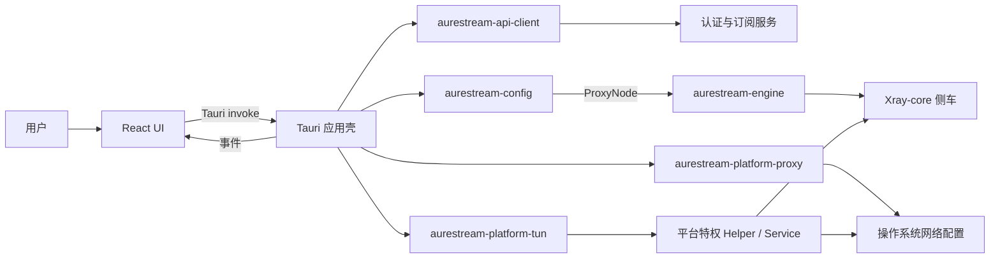
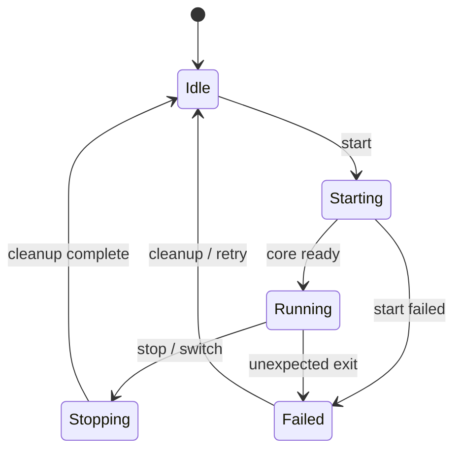
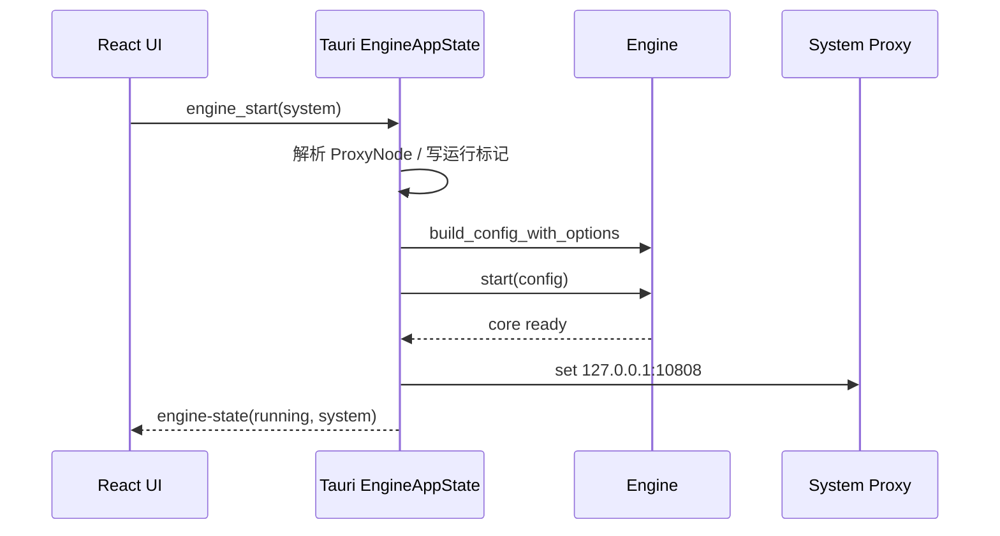
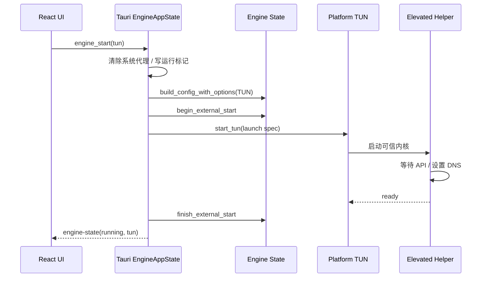

# AureStream v2 架构设计

本文描述 AureStream v2 当前实现的架构边界、运行时流程和扩展约束。实现与文档冲突时，以根目录 `src/`、`src-tauri/` 和 `crates/aurestream-*` 下的代码为准。

## 1. 设计目标

- 默认通过系统代理捕获流量，TUN 作为需要提权组件的可选模式。
- 前端只表达用户意图，不生成内核配置，也不直接操作系统代理或特权服务。
- 内核配置方言、进程生命周期和异常退出检测收敛在 `aurestream-engine`。
- 系统代理与 TUN 操作按平台隔离，所有失败路径都尽力恢复代理和 DNS。
- 应用壳依赖对象安全的 `Engine` 接口，为后续替换或并存多个内核保留边界。
- 特权进程只执行经过约束的程序和配置，不接受任意可执行文件路径。

## 2. 系统上下文



系统代理模式由应用进程启动内核，再修改操作系统代理。TUN 模式由平台特权组件启动内核，应用进程不得重复启动用户态侧车。

## 3. 分层与代码边界

| 层级 | 目录 | 职责 | 禁止事项 |
|---|---|---|---|
| 前端 | `src/` | 页面、交互、事件订阅、薄 IPC 封装 | 不生成 Xray JSON，不操作特权资源 |
| 应用壳 | `src-tauri/` | IPC、托盘、日志、状态协调、生命周期清理 | 不实现内核配置方言 |
| API | `crates/aurestream-api-client/` | 认证、会话、订阅请求 | 不参与引擎生命周期 |
| 配置解码 | `crates/aurestream-config/` | 将订阅内容解码为 `ProxyNode` | 不输出任何内核专用 JSON |
| 引擎 | `crates/aurestream-engine/` | `Engine` 接口、状态机、配置构建、内核进程监管 | 不直接修改系统代理或 DNS |
| 系统代理 | `crates/aurestream-platform-proxy/` | 各平台系统代理设置与清理 | 不管理内核进程 |
| TUN | `crates/aurestream-platform-tun/` | 特权组件安装、TUN 启停、DNS 恢复 | 不接受未约束的内核或配置路径 |

依赖方向保持为：应用壳依赖领域 crate；平台 crate 和引擎 crate 互不反向依赖；前端只通过 IPC 合约访问 Rust。

## 4. 通信模型

### 4.1 前端到 Rust

前端通过 `src/lib/ipc.ts` 中的薄封装调用 Tauri command。核心类别包括：

- 认证：登录、注册、恢复会话、退出。
- 订阅：同步订阅、读取快照。
- 引擎：选择节点、启动、停止、读取当前状态。
- 网络：TCP 延迟探测。

### 4.2 Rust 到前端

后台状态通过事件推送，前端 Context 是事件的消费方：

| 事件 | 含义 |
|---|---|
| `auth-changed` | 当前登录用户发生变化 |
| `subs-updated` | 订阅及节点快照更新 |
| `engine-state` | 引擎状态、捕获模式或选中节点变化 |
| `app-alert` | 需要用户感知的后台错误 |

`engine_get_state` 只用于首次水合；之后以 `engine-state` 为准。托盘与页面共用 `EngineAppState`，不维护第二份捕获模式状态。

## 5. 内核抽象

`aurestream-engine::Engine` 是应用壳依赖的对象安全接口，通过 `SharedEngine = Arc<dyn Engine>` 注入。当前唯一实现是 `XrayEngine`。

接口分为四组能力：

1. 元数据：`config_filename`、`launch_spec` 和稳定的 `KernelId`。
2. 配置：从 `ProxyNode` 和 `BuildOptions` 构建内核配置。
3. 用户态生命周期：`start`、`stop`、`state` 和异常退出事件。
4. 外部生命周期：TUN Helper 拥有进程时，通过 `begin_external_start`、`finish_external_start`、`fail_external_start` 和 `finish_external_stop` 驱动同一状态机。

`KernelLaunchSpec` 向受控的 TUN 层提供内核 ID、配置文件名、可执行文件和资源目录。当前特权 Helper 明确只接受 `KernelId::XRAY`，因此新增内核不会自动获得提权执行能力。

应用壳的 `create_engine` 是当前唯一内核选择点。增加新内核时应：

1. 在 `aurestream-engine` 中实现 `Engine`，将配置方言保留在该 crate。
2. 为进程退出实现带 generation 的事件，避免旧进程事件污染新会话。
3. 在 `create_engine` 中增加选择策略，并保持配置文件名无 IO 可得。
4. 若支持 TUN，逐个平台扩展 Helper 协议、可信安装和校验逻辑；否则返回明确的 `tun_kernel_unsupported:<id>`。
5. 增加配置、状态转换、异常退出和平台权限边界测试。

## 6. 引擎与捕获状态

引擎状态机为：



操作系统流量捕获使用独立的 `CaptureMode`：`Off`、`SystemProxy`、`Tun`。二者由 `EngineAppState` 统一协调，所有启动、停止、节点切换、托盘操作和退出清理通过单飞锁串行执行。

## 7. 运行时流程

### 7.1 系统代理模式



停止顺序固定为先清除系统代理，再停止内核。启动中任一步失败都会进入统一清理路径。

### 7.2 TUN 模式



TUN 默认使用 `1.1.1.1` 作为操作系统 DNS 劫持目标。`198.18.0.1` 是 TUN 网关地址，不应作为宿主机 DNS 服务器。

## 8. 故障恢复

`cleanup_runtime` 是唯一运行时清理入口，供 IPC 停止、托盘、模式切换、启动失败、内核健康监控和应用退出复用。清理会尝试所有步骤，并聚合错误，不因前一步失败跳过后续恢复。

应用在产生进程或修改捕获状态前，以原子替换方式写入 `engine-runtime.json`，内容包含 `session_id` 和捕获模式。正常清理成功后删除标记；下次启动发现残留标记时会协调清除系统代理、停止残留 TUN 并恢复状态。

Xray 用户态子进程由 supervisor 监管：

- 每次启动分配 generation ID。
- 仅当前 generation 的意外退出可以将状态置为 `Failed`。
- 显式停止不会产生错误事件。
- 异常退出触发捕获清理、`engine-state` 和 `app-alert`。

## 9. TUN 特权边界

| 平台 | 提权机制 | 可信执行与恢复策略 |
|---|---|---|
| Linux | `pkexec` + Polkit | Helper 固定在 `/usr/lib/AureStream`；仅执行 root 持有、非符号链接且不可被普通用户写入的 Xray；配置限制在调用用户的 AureStream app-data 下并复制为 root-only 快照；会话记录在 `/run/aurestream-tun`，通过 UID、PID 和 `/proc` 启动时间监控应用，异常退出后停止内核并恢复 DNS |
| Windows | SCM `AureStreamTunService` | UAC 安装时将服务、Xray、Wintun 和 geo 资源复制到 ProgramData 并记录 SHA-256；服务只解析固定安装位置，配置限制在用户 Roaming/Local AureStream app-data；持有主应用进程句柄，应用退出后停止内核、恢复 DNS 并停止服务 |
| macOS | SMJobBless `com.root.aurestream.helper` | 已签名 Helper 通过 XPC 启动内核，并在 API 就绪后用 `networksetup` 修改 DNS；正常停止时先恢复 DNS再结束内核 |

Linux AppImage 不安装 `/usr` 下的 Helper，因此不作为 TUN 安装路径；应使用 deb/rpm 或开发安装脚本。Windows TUN 构建需要 `pnpm build-tun` 和 `wintun.dll`。macOS 打包前需要 `pnpm pre-bundle` 生成并签名 Helper。

### macOS 已知限制

macOS 当前没有覆盖“主应用被强制终止后，特权 Helper 独立恢复 DNS”的完整闭环。完整方案需要把 DNS 快照和会话所有权下沉到 SMJobBless XPC Helper，并扩展 Objective-C/FFI 协议；在完成跨进程测试前，不应加入只恢复部分状态的实现。

## 10. 持久化与运行文件

应用数据目录包含：

| 文件 | 用途 | 生命周期 |
|---|---|---|
| `engine-selection.json` | 持久化选中节点 | 用户选择变化时更新 |
| `engine-runtime.json` | 异常恢复意图，包含会话 ID 与捕获模式 | 启动捕获前写入，清理成功后删除 |
| 内核配置文件 | 由当前 `Engine` 实现生成 | 每次启动或切换节点时覆盖 |

日志按平台写入应用日志目录：应用日志为 `aurestream-app.log`，内核日志按日期命名为 `aurestream-core-YYYY-MM-DD.log`。日志中的 `session_id` 用于关联一次启动与清理事务。

## 11. 构建与验证

本地基础验证：

```bash
corepack pnpm test
corepack pnpm build
cargo test --workspace
```

平台构建还需要：

- Windows：`pnpm build-tun`，并提供 `wintun.dll`。
- macOS：`pnpm pre-bundle`，确保应用与 Helper 使用匹配签名。
- Linux：使用 deb/rpm 验证 Helper 和 Polkit 安装；开发环境可运行 `scripts/install-linux-tun-helper.sh`。

桌面 CI 在各平台矩阵中执行前端测试和 `cargo test --workspace`。涉及特权组件的变更还必须进行对应平台的安装、启动、异常退出和 DNS 恢复测试。

## 12. 架构约束清单

- 新功能仅进入 v2 目录（`src/`、`src-tauri/`、`crates/aurestream-*`）。
- 前端和 `aurestream-config` 不生成内核 JSON。
- 所有引擎生命周期变更必须经过状态机。
- 系统代理失败或停止时必须尽力清除代理。
- TUN 停止或异常退出时必须尽力恢复 DNS。
- 特权服务不得接受任意可执行文件路径、任意配置路径或未经校验的资源。
- 系统代理和 TUN 互斥，切换模式必须先走统一清理。
- 用户可见的后台失败通过 `app-alert` 展示，不能只写日志。
