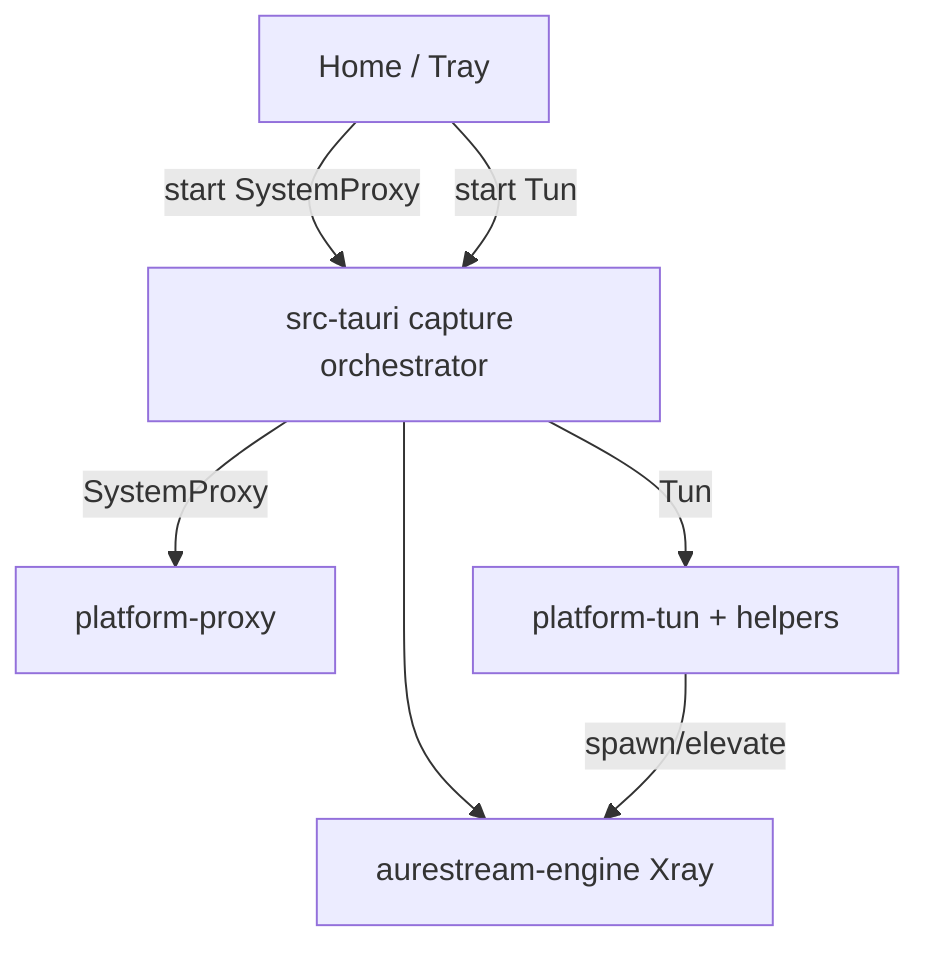

# 三端虚拟网卡（TUN）代理实现计划

## 背景与约束

当前 v2 MVP 为**系统代理 only**（见 `AGENTS.md`）。用户明确要求实现 **Windows / macOS / Linux 虚拟网卡代理**，即产品层重新启用 TUN。

Legacy 已有完整实现可移植，但三端差异大：

| 平台 | 特权模型 | 核心进程身份 | DNS 劫持 |
|------|----------|--------------|----------|
| Windows | 一次性 UAC 安装 SCM 服务 `AureStreamTunService` | LocalSystem 服务内跑 `aurestream-core` | HKLM NameServer → `settings.dns[0]`（如 1.1.1.1） |
| macOS | SMJobBless 特权 Helper（root XPC） | Helper root `posix_spawn` core | `networksetup` 主网卡 DNS → **TUN gateway**（198.18.0.1） |
| Linux | deb/rpm 安装 polkit + `pkexec` shell helper | root 下 `exec` core | `resolvectl dns` → gateway |

**不可接受的做法：** 在用户态直接开 TUN（三端均需提权）；把 TUN 塞进 `aurestream-platform-proxy`（破坏「系统代理 only」边界）。

**必须保持：** 默认 `enableTun=false` 时，系统代理 start/stop 路径与今日一致。

---

## 目标架构

把「内核运行」与「OS 捕获层」拆开：

```text
UI / 托盘
  → CaptureMode: Off | SystemProxy | Tun   （互斥）
  → Shell 编排（src-tauri）
       ├─ Engine: build_config + start/stop sidecar
       ├─ platform-proxy: set/clear 系统代理
       └─ platform-tun:  enable/disable TUN 捕获（新 crate + 各平台 helper）
```



### 模式语义

| CaptureMode | Sidecar | 系统代理 | TUN/DNS |
|-------------|---------|----------|---------|
| Off | 停 | 清 | 清 |
| SystemProxy | 用户态跑 | 指向 mixed | 无 |
| Tun | 提权跑（或服务内跑） | **必须清除** | 开 |

互斥：切模式 = 先拆当前捕获 →（必要时）重建 config → 再启新捕获。Xray **无可靠 SIGHUP 热切 TUN**，采用 **stop → rebuild → start**（与 legacy 一致）。

---

## 分阶段交付

### Phase 0 — 契约与配置方言（全平台共用，1–2 天）

**Engine**

- 扩展 `build_config` 选项，例如：

```rust
pub struct BuildOptions {
  pub socks_port: u16,
  pub api_port: u16,
  pub enable_tun: bool,
  pub enable_ipv6: bool,      // 可选 Phase 1 先 false
  pub bypass_router: bool,    // 可选 Phase 2
  pub smart_routing: bool,    // geosite:cn 等，可 Phase 2
}
```

- `enable_tun=true` 时在现有 mixed inbound 外增加 `tun-in`（移植 `legacy/src/config/xray-base-template.ts` 的 `buildTunInbound`）：
  - `name`: `utun233`（Xray 跨平台接口名约定）
  - `gateway`: `198.18.0.1/30`
  - `dns`: `1.1.1.1`, `8.8.8.8`
  - `autoSystemRoutingTable`: 默认排除 LAN 的 IPv4 列表（非 bypass-router）
  - sniffing 与 `port 53 + inboundTag tun-in → dns-out` 规则
- **保留** mixed inbound：本地探测 / 系统代理仍可用；TUN 模式启动后 shell **清除**系统代理。
- 单测：
  - 默认无 tun（现有测试不破）
  - `enable_tun` 含 `tun-in` 与 DNS capture 规则

**Shell 状态**

- `CaptureMode { Off, SystemProxy, Tun }` 提升为编排真源（tray 已有雏形）。
- `EngineStatePayload` 增加 `captureMode`（或独立 `capture-state` 事件）。
- IPC：`engine_start` 接受 `mode: "system" | "tun"`（或读 prefs）；新增 `engine_get_capture` 如需。

**Frontend**

- Home「虚拟网卡」开关：读/写 `proxy-prefs.enableTun`，可点击。
- 连接逻辑：
  - 仅系统代理开 → SystemProxy
  - 仅虚拟网卡开 → Tun
  - 两者互斥（开 A 关 B），与托盘一致。
- 托盘「虚拟网卡」：启用，勾选反映 `CaptureMode::Tun`。

**验收：** 配置 JSON 正确；UI/托盘能切换模式偏好；未装 helper 时 TUN 启动给出明确错误弹窗。

---

### Phase 1 — Windows TUN（优先可测，2–4 天）

移植自：

- `legacy/crates/aurestream-plugin-tun`（`scm.rs`, `service.rs`, `dns.rs`, `main.rs`）
- `legacy/crates/aurestream-plugin-privilege/src/windows.rs`
- `legacy/src-tauri/src/engine/windows/*`（outbound_if、watchdog、config_patch）

**新 crate：** `crates/aurestream-platform-tun`（Windows 先落地）

API 草案：

```rust
ensure_installed() -> Result<InstallState>
probe() -> ServiceState
start_tun(config, core_path, dns_hijack) -> Result<()>
stop_tun() -> Result<()>
```

**编排（shell）：**

1. 首次：UAC 安装 `tun-service` → ProgramData + SCM ACL（Authenticated Users 可 start/stop）
2. 解析默认出口网卡，patch `autoOutboundsInterface` + direct sockopt（避免 Hyper-V 网卡误选）
3. `scm::start_service_with_args([config, dns_hijack, core])`
4. 服务内：spawn core → 等 API ready → NameServer 劫持 → flushdns
5. `clear_system_proxy`
6. 停止：stop service → 服务还原 DNS；应用启动时 orphan service 清理

**打包：**

- 恢复 `download-binaries` 的 **wintun.dll** 分发（`resources/wintun-<triple>.dll` → 运行时拷到 core 旁）
- `build-tun-service` 接入 `pnpm` / CI（feature 或独立 job，不必绑默认 `release` 直到稳定）
- `tauri.windows.conf.json`：`externalBin` 增加 `tun-service`

**验收：** Windows 上 TUN 全机流量；断开还原 DNS；与系统代理互切不残留代理/DNS。

---

### Phase 2 — macOS TUN（3–5 天，含签名）

移植自：

- `legacy/crates/aurestream-plugin-privilege/macos-helper/**`
- `legacy/crates/aurestream-plugin-privilege/src/macos/**`
- `legacy/crates/aurestream-plugin-tun/src/macos/**`（DNS + watcher）
- `legacy/src-tauri` macOS engine / prebundle / SMJobBless plist

**要点：**

- SMJobBless Helper：`com.root.aurestream.helper`
- Helper root spawn `aurestream-core`（从调用方 app bundle 解析 core 路径）
- DNS：主网卡写入 gateway 优先；`SCDynamicStore` watcher 防被系统改回
- 停止：**先写回 DNS 再杀 core**（两阶段，防断网）
- `clear_system_proxy` on TUN start
- 可选 Phase 2b：bypass-router + IP forward + watchdog（可后置）

**打包 / 开发：**

- `legacy`/历史 `scripts/prebundle.ts`（实现时再迁回 v2）、签名、`Info.privileged-helper.plist`
- 文档：纯 `tauri dev` 无签名时 TUN **不可用**；需 signed bundle 或已安装 helper

**验收：** 已签名包上 TUN 可用；断网恢复 DNS；切换系统代理无残留。

---

### Phase 3 — Linux TUN（2–3 天）

移植自：

- `legacy/crates/aurestream-plugin-privilege/linux-helper/**` + `src/linux.rs`
- `legacy/crates/aurestream-plugin-tun/src/linux/mod.rs`
- deb/rpm 打包映射 + `deb-postinst/postrm`

**要点：**

- `pkexec` + `/usr/lib/AureStream/aurestream-tun-helper`
- polkit policy + rules（建议收紧 legacy 过宽的 `allow_any=yes`）
- DNS：`resolvectl`；建议改进为 **core ready 后再 hijack**（对齐 Windows，降低启动黑洞）
- 修复 legacy `on_network_up` 误传 config path 的 bug（若移植网络钩子）
- AppImage **默认不保证** TUN（无法写 `/usr`）；deb/rpm 为正式路径

**验收：** deb 安装后 TUN 可用；卸载清理 helper/polkit；无 polkit 时错误可理解。

---

### Phase 4 — 产品打磨与回归（1–2 天）

- 失败统一走现有错误弹窗 + 日志（`aurestream-app.log` / core log）
- 托盘与 Home 勾选/开关与 `captureMode` 事件一致
- 退出 / 崩溃：各平台 best-effort 清 TUN + DNS + 系统代理
- 回归：仅系统代理路径；测速；节点切换
- 更新 `AGENTS.md`：TUN 为可选能力；默认 release 是否含 helper 由产品开关
- 文档：各平台安装特权组件步骤与限制

---

## 关键文件地图（v2）

| 区域 | 动作 |
|------|------|
| `crates/aurestream-engine/src/xray/config.rs` | TUN inbound + DNS/routing |
| `crates/aurestream-platform-tun/` | **新建** 三端 TUN 编排 API |
| `legacy/crates/aurestream-plugin-tun` → 抽逻辑进 platform-tun | 移植非 Windows-only 部分按 cfg |
| `legacy/crates/aurestream-plugin-privilege` → `crates/aurestream-privilege` 或并入 platform-tun | helper 客户端 |
| `src-tauri/src/commands/engine.rs` | capture 编排、fail_cleanup 分支 |
| `src-tauri/src/tray.rs` | 启用 Tun 菜单与互斥 |
| `src/components/HomePage.tsx` + `proxy-prefs` | 虚拟网卡开关接线 |
| `src/lib/ipc.ts` | start mode / capture 状态 |
| `scripts/download-binaries.ts` | wintun 可选 |
| 历史 `prebundle` / `build-tun-service`（现已从 `scripts/` 移除，实现时从 `legacy` 或 git 恢复） | 接回 v2 路径 |
| `.github/workflows/*` | 分平台 artifact（helper / tun-service） |

---

## 风险与决策

1. **签名与发布：** macOS Helper / Windows 服务安装依赖签名与 UAC；CI 与本地 dev 路径不同，需文档写清。
2. **Xray 版本：** TUN 字段需足够新的 Xray（legacy 注 ≥ v26.4.13）；与 `download-binaries` 版本对齐。
3. **DNS 策略差异：** Windows 用 public DNS hijack，macOS/Linux 用 gateway——移植时保持各平台已验证策略，不在 Phase 1 强行统一。
4. **范围控制：** Phase 1 不做 bypass-router / 完整 geosite 智能分流进 TUN；先「能全局走 TUN + 私网直连」。
5. **安全：** Linux polkit 不要原样复制过宽 defaults；Windows SDDL 保持「安装一次、日常无 UAC」。

---

## 建议实施顺序（执行时）

1. Phase 0 契约 + UI/托盘接线（TUN 调用失败可提示「组件未安装」）
2. Phase 1 Windows 端到端
3. Phase 2 macOS（有签名环境）
4. Phase 3 Linux deb
5. Phase 4 打磨与文档

**预估总工作量：** 约 10–16 人日（含三端联调与打包），视签名/CI 环境而定。

---

## 非目标（本计划明确不做）

- 默认把 TUN 绑进无条件 `pnpm release`（可用 `AURESTREAM_WITH_TUN=1` 或单独 workflow）
- Network Extension / 系统扩展级 macOS 方案（继续 SMJobBless helper）
- 多引擎 sing-box TUN
- 在未提权情况下的「假 TUN」

