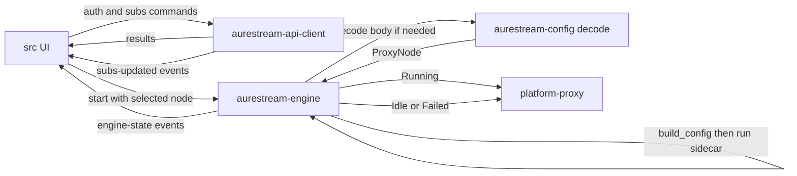

# AureStream v2 — Clear Boundaries Redesign

**Date:** 2026-08-05  
**Status:** Approved for implementation planning  
**Repo:** [AureStream/AureStream](https://github.com/AureStream/AureStream)  
**Supersedes:** Ad-hoc evolution of the current `src/` + `src-tauri/` app (sing-box → Xray migration residue, TUN/DNS patches, serial bootstrap gates)

## 1. Goals

Rebuild a desktop proxy client in this repository with:

- Clear module boundaries (UI / API / subscription-decode / engine / platform)
- Event-driven startup so the home screen is not blocked on long sync
- Fresh UI (IA + visuals), same stack family
- MVP without TUN; system proxy only
- Engine-swappable config generation (decode shared; each engine emits its own config dialect)

Non-goals for MVP:

- TUN / privileged helper rewrite
- Multi-engine runtime (trait only; one implementation)
- Preserving or maintaining the old application tree for features/fixes
- Default random balancer over dozens of subscription nodes

## 2. Decisions (locked)

| Topic | Choice |
|---|---|
| Delivery | Rewrite in-repo; old app not maintained |
| Layout | Keep root `src/` + `src-tauri/` (not `apps/desktop`) |
| Old code | Move to `legacy/` or delete after tag; reference only |
| MVP | Auth (email code register) + subscriptions + system proxy + node select + connect |
| Engine | `Engine` trait; MVP implementation = Xray-core |
| Config split | `aurestream-config` **decode only**; **each engine** builds its own config JSON |
| Backend | Existing Worker API (`/auth/*`, `/subscriptions`) |
| UI stack | Tauri v2 + React + Tailwind v4 + shadcn; new IA and visuals |
| Startup | Event-driven; no serial `sessionReady` / merge gate on Home |

## 3. Repository layout

```text
AureStream/
  src/                            # New React app (only UI entry)
  src-tauri/                      # New thin Tauri shell
  crates/
    aurestream-api-client/        # HTTP auth + subscriptions (no UI)
    aurestream-config/            # Decode subscription → Vec<ProxyNode> only
    aurestream-engine/            # Engine trait + XrayEngine (build_config + run) + state machine
    aurestream-platform-proxy/    # OS system proxy set/clear only
  legacy/                         # Former src + src-tauri (+ optional old crates), unmaintained
  docs/superpowers/specs/         # This document
```

Hard rules:

1. UI talks to Rust only via a small IPC surface; never builds engine JSON in the renderer for production paths.
2. Engine does not call Worker HTTP and does not know React.
3. `aurestream-config` does **not** emit Xray or sing-box JSON; it only produces an engine-agnostic `ProxyNode` model.
4. Config dialect (inbounds, DNS, routing field names) lives **inside the engine implementation** (`build_config` / write file).
5. Platform-proxy does not know Xray or sing-box.
6. New features land only in the new tree; `legacy/` is read-only reference.

## 4. Runtime data flow



Typical path:

```text
subscription body
  → aurestream-config::decode → ProxyNode
  → Engine::build_config(node, ports) → config.json  (Xray dialect in MVP)
  → Engine::start(config_path)
  → platform-proxy set
```

Later, a `SingboxEngine` would implement the same trait and emit sing-box JSON from the same `ProxyNode`; decode stays unchanged.

### 4.1 Engine state machine

`Idle → Starting → Running → Stopping → Idle`, plus `Failed(reason)`.

UI renders state; it does not invent parallel “connecting” flags that disagree with the engine.

### 4.2 Start (system proxy)

1. Require logged-in session, synced or cached nodes, and a selected node (or deterministic default).
2. Resolve `ProxyNode` (from decode cache / `aurestream-config`).
3. **Active engine** writes a minimal config for system-proxy mode: local mixed/socks inbound, **single** selected outbound, direct/block, minimal DNS (**no TUN**). MVP: `XrayEngine::build_config`.
4. Engine starts sidecar and readiness-probes the local port.
5. Platform-proxy enables system proxy to that port.
6. On any failure: stop engine, clear system proxy, emit `Failed`.

### 4.3 Stop

Clear system proxy first, then stop the sidecar (minimize leak / blackhole window).

### 4.4 Node switch while Running

Prefer engine-native outbound override API when available; on failure, stop → `build_config` again → start. No multi-layer hot-reload stack from the legacy app.

### 4.5 IPC (MVP)

**Commands:** `auth_login`, `auth_register`, `auth_verify`, `auth_logout`, `subs_sync`, `subs_list`, `engine_start`, `engine_stop`, `engine_select_node`, `engine_get_state`.

**Events:** `auth-changed`, `subs-updated`, `engine-state`, optional `traffic`.

Commands trigger work; **events are the source of truth for UI state.**

### 4.6 `ProxyNode` (decode output)

Engine-agnostic fields only, for example: `tag`, `name`, `protocol`, server address/port, TLS/Reality/WS/gRPC parameters, optional fragment hints.  
Do **not** store Xray-only JSON keys on the shared model; mapping to outbound objects happens inside `XrayEngine::build_config` (or a future sing-box mapper).

## 5. Event-driven startup (home latency)

### 5.1 Problem in legacy

Home waited on serial gates (force-update, token restore, subscription sync, config pre-merge / `sessionReady`) before painting useful UI.

### 5.2 Rules

1. Paint shell immediately (login or home skeleton).
2. Gate only on auth route vs app route (logged in or not)—not on “all data ready”.
3. Subscription sync, node parse, latency tests run in background; completion emits events.
4. No waiting for config generation before Home.
5. Avoid a second full `GET /subscriptions` on Home mount if login/restore already synced; use cache + `subs-updated`.

### 5.3 Boot sequence

```text
App mount
  → render shell now
  → parallel: local token restore
  → emit auth-changed
  → if authenticated: navigate to app shell; show inline “同步中” where needed
  → background subs_sync → emit subs-updated
  → Connect button: if nodes not ready, busy/disabled with reason—not a full-page spinner
```

## 6. UI information architecture

| Route | Purpose |
|---|---|
| `/login` | Email + password |
| `/register` | Same-page two-step: credentials → email code → auto login |
| `/` | Connect control, current node, engine state, light traffic if cheap |
| `/nodes` | Nodes for current subscription; select node |
| `/profile` | Account, subscription summary, logout |

Contexts: `Auth`, `Engine`, `Subs`—no Redux. Chinese copy only.

Visual: new composition and tokens on Tailwind/shadcn; do not clone the legacy purple-shield stack as the hero identity.

Multi-subscription: may list/sync multiple remote subs; **engine always uses one active subscription + one selected node** for MVP.

## 7. Config policy (MVP)

- Decode once into `ProxyNode`; engines own dialects.
- One active outbound (selected node), not a random balancer of the entire list.
- System proxy mode only; no TUN inbound in generated config.
- Prefer small, readable JSON over legacy template + cache-key machinery.
- Switching kernel later = new `Engine` impl + new `build_config`; **not** a rewrite of `aurestream-config`.

## 8. Testing & acceptance (MVP)

- Unit: subscription decode → `ProxyNode`; `XrayEngine::build_config` (single outbound, no tun); auth error mapping; engine state transitions (mock sidecar where needed).
- Manual / machine: login → sync → select node → system proxy on → browse; stop → proxy cleared.
- Performance: cold start to interactive Home shell **without** waiting for `subs_sync` completion; sync completes via `subs-updated` afterward.

## 9. Migration steps (high level)

1. Tag current tip; move unmaintained tree to `legacy/` (or delete after tag).
2. Scaffold empty `src/` + `src-tauri/` wired to new crates.
3. Implement api-client + auth/register UI.
4. Implement decode (`aurestream-config`) + engine (Xray `build_config` + run) + platform-proxy.
5. Home/nodes with event-driven boot.
6. Point root `pnpm` / CI scripts at the new app only.
7. TUN and advanced routing = later specs, new crates/boundaries—not bolted onto MVP shortcuts.
8. Optional later: `SingboxEngine` implementing the same trait.

## 10. Out of scope (follow-up specs)

- Windows/macOS/Linux TUN and DNS hijack
- Observability / least-ping balancers
- Tray, autostart, force-update UX redesign
- Engine second implementation (sing-box) behind the same trait
